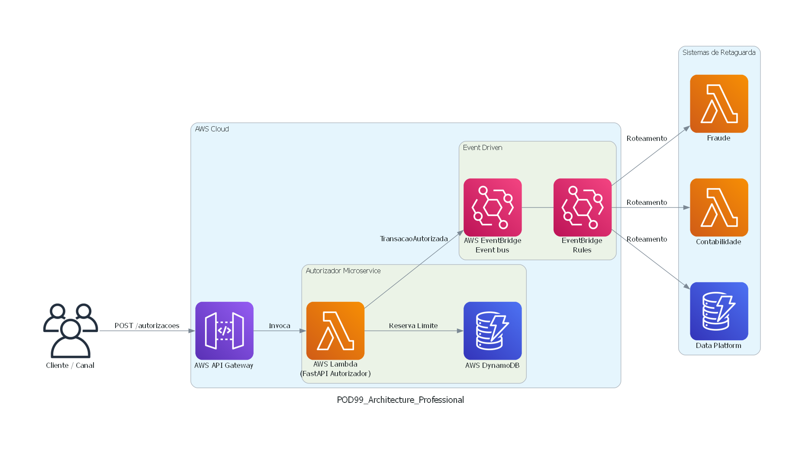

# Arquitetura da Solução

Abaixo apresentamos o desenho arquitetural da Plataforma de Autorização desenhada para a AWS usando Serverless.

## Como a arquitetura atende aos requisitos funcionais e não-funcionais:
1. **Volumetria (5.000 TPS)**: O AWS Lambda e API Gateway escalam automaticamente para suportar picos bruscos sem necessitar de pré-provisionamento. O DynamoDB entrega latências na casa de milissegundos para escrita e leitura independente do volume.
2. **Consistência de Dados**: Evitamos o débito duplo usando o *Optimistic Locking* diretamente nas chamadas do SDK (`ConditionExpression` checando a versão do contrato).
3. **Desacoplamento**: O sistema processa o crédito, atualiza o limite síncronamente e propaga a notificação usando EventBridge para que outros serviços internos se virem, mantendo a latência da API focada na autorização.
